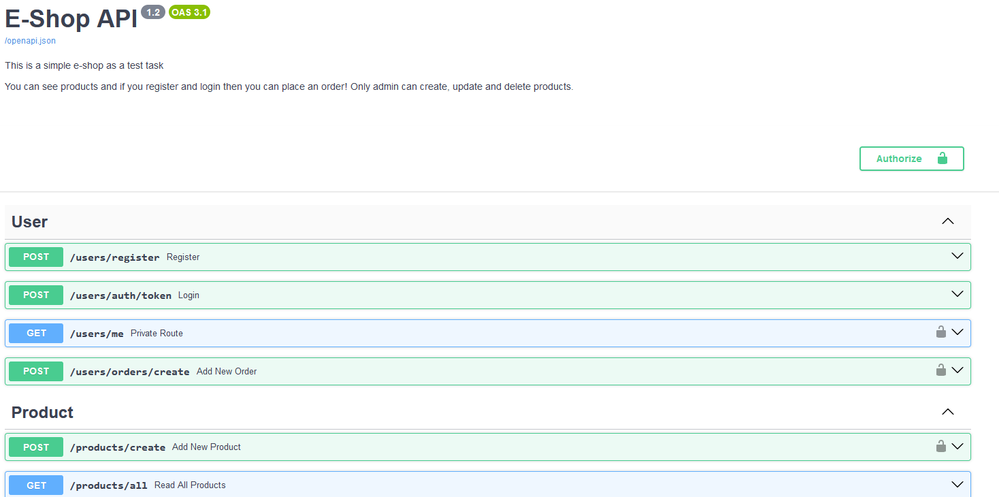
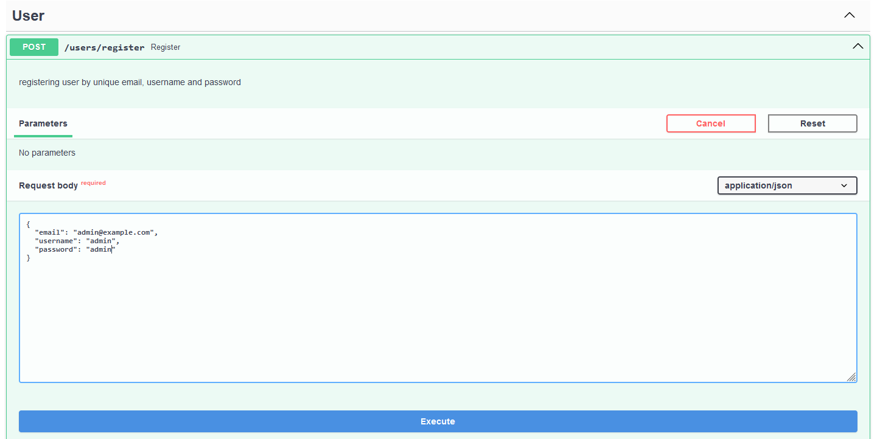
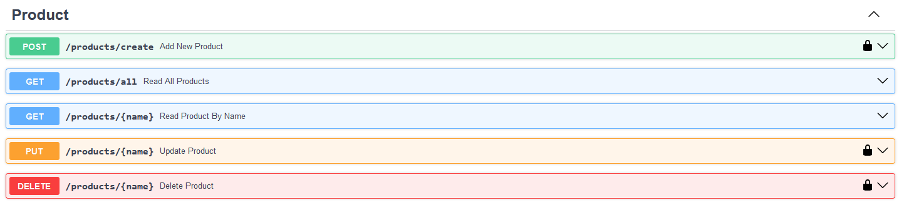

# E Shop by FastAPI, Postgresql and Docker

## About

This code is implementation of simple e-shop as a task for Lagrange Co. in **FastAPI** framework.
for ORM it use **SQLAlchemy**, and database is **postgresql**.
more information of task can be seen in [task_deceleratiom](./doc_resource/task_deceleration.pdf)

---

## Features

In this app three models created in database:**Users, Product and Order**. You can see them in the app/db_models.py file.
Each order contsind foreign key to user and products to implementing 1-to-many relationship between them.
**pydantic schemas** used for validate inut and output of endpointd properly. these schemas can be found in app/schema_models.py file.

## Code Structure

For better organization of the code, cruds (create, read, update and delete) related to each model was written in seprated file and gather together in `app/cruds` directory. Endpoints in similar way are in `app/routers`.
Essential authentication functions are in `app/security.py` and database scripts written in `app/db.py` file.

---

## Installation and Run

After cloning this repository you have two options:

### Option One:

Go to the `NoDocker` directory and you can use virtual environment and install neccesary pakages by:
`pip install -r requirements.txt`
Finally run app: `python main.py`.
Notice in this case it use sqlite as a database.

### Option Two: Docker and Postgresql

Just run:
`sudo docker compose up -d --build`
It will install requirements and create image from `Dockerfile` for app, then based on `docker-compose.yml`, create service that has two container: web (fastAPI app) and db (psql database).

---

## See Results

after installing and running , go to the browser and type this url:
`http://localhost:8000/docs`
for access to automated documentation of FastAPI by swagger. You will see something like this:



In the top of page you can see customized information of app like title, version and short description. Then all endpoints are listed bellow. by clicking on first one, i.e. `POST /users/register` and then try it out, you can send data for registeration. please register as a admin in order to access to create products later.(if you using app.db from this repo -in the NoDocker manner- then user admin by password=admin is already exists.)



Authorize button (in the top-right-side of page) is for login. for palcing order you must authorize, otherwise you only can see products (you should crrate products first!).
Notice: Auth2 is a background of login in this app, and it get username and password. but in a e-shop this is not common to enforce users to have unique username. so you should enter your email for authorizathin at username field. later, frontend team can show this fild as a email.

in Product endpoints, you can do CRUD for products. any body can see products. but for adding, deleting or updating you should login as an admin.



Besides, for automated testing, in the /app directory after installing pytest, type `pytest` and some tests will be pass. more tests can be added based on feuture situations.

---

# Dockerization

In `Dockerized_FastAPI_Postgress` directory you can see Dockerfile for creatinf image of FastAPI app:

```
# Dockerfile

# pull the official docker image
FROM python:3.11.1-slim

# set work directory
WORKDIR /app

# set env variables
ENV PYTHONDONTWRITEBYTECODE 1
ENV PYTHONUNBUFFERED 1

# install dependencies
COPY requirements.txt .
RUN pip install -r requirements.txt

# copy project
COPY . .
```

In addition, docker-compose.yml is available:

```
# docker-compose.yml

version: "3.8"

services:
  web:
    build: .
    command: bash -c 'while !</dev/tcp/db/5432; do sleep 1; done; uvicorn app.main:app --host 0.0.0.0'
    volumes:
      - .:/app
    ports:
      - 8000:8000
    environment:
      - DATABASE_URL=postgresql://fastapi_lgrn:fastapi_lgrn@db:5432/fastapi_lgrn
    depends_on:
      - db
  db:
    image: postgres:15-alpine
    volumes:
      - postgres_data:/var/lib/postgresql/data/
    expose:
      - 5432
    environment:
      - POSTGRES_USER=fastapi_lgrn
      - POSTGRES_PASSWORD=fastapi_lgrn
      - POSTGRES_DB=fastapi_lgrn

volumes:
  postgres_data:

```

You can set your desired environment variable and ports.
As it was said, for runing this app by docker just typy in the root of project:
`sudo docker compose up -t --build`
if there was a problem you can see logs of servece by
`sudo docker compose logs`
and logs of any related container in similar way to debug the issue.

For deployment by docker swarm and teraefik (as a web server and reverse proxy) the Dockerfile.prod and docker-compose.prod.yml is provided. but they are not tested and maybe need more consideration.

---

## Requirements

```
annotated-types==0.5.0 ; python_version >= "3.8" and python_version < "4.0"
anyio==3.7.1 ; python_version >= "3.8" and python_version < "4.0"
anyio[trio]==3.7.1 ; python_version >= "3.8" and python_version < "4.0"
async-generator==1.10 ; python_version >= "3.8" and python_version < "4.0"
attrs==23.1.0 ; python_version >= "3.8" and python_version < "4.0"
bcrypt==4.0.1 ; python_version >= "3.8" and python_version < "4.0"
cffi==1.15.1 ; os_name == "nt" and implementation_name != "pypy" and python_version >= "3.8" and python_version < "4.0"
click==8.1.4 ; python_version >= "3.8" and python_version < "4.0"
colorama==0.4.6 ; python_version >= "3.8" and python_version < "4.0" and platform_system == "Windows"
dnspython==2.3.0 ; python_version >= "3.8" and python_version < "4.0"
email-validator==2.0.0.post2 ; python_version >= "3.8" and python_version < "4.0"
exceptiongroup==1.1.2 ; python_version >= "3.8" and python_version < "3.11"
fastapi==0.100.0 ; python_version >= "3.8" and python_version < "4.0"
fastapi-login==1.9.1 ; python_version >= "3.8" and python_version < "4.0"
greenlet==2.0.2 ; python_version >= "3.8" and python_version < "4.0" and (platform_machine == "win32" or platform_machine == "WIN32" or platform_machine == "AMD64" or platform_machine == "amd64" or platform_machine == "x86_64" or platform_machine == "ppc64le" or platform_machine == "aarch64")
h11==0.14.0 ; python_version >= "3.8" and python_version < "4.0"
idna==3.4 ; python_version >= "3.8" and python_version < "4.0"
mypy-extensions==1.0.0 ; python_version >= "3.8" and python_version < "4.0"
mypy==1.4.1 ; python_version >= "3.8" and python_version < "4.0"
outcome==1.2.0 ; python_version >= "3.8" and python_version < "4.0"
passlib[bcrypt]==1.7.4 ; python_version >= "3.8" and python_version < "4.0"
pycparser==2.21 ; python_version >= "3.8" and os_name == "nt" and implementation_name != "pypy" and python_version < "4.0"
psycopg2-binary
pydantic-core==2.1.2 ; python_version >= "3.8" and python_version < "4.0"
pydantic-settings==2.0.1 ; python_version >= "3.8" and python_version < "4.0"
pydantic==2.0.2 ; python_version >= "3.8" and python_version < "4.0"
pyjwt==2.7.0 ; python_version >= "3.8" and python_version < "4.0"
python-dotenv==1.0.0 ; python_version >= "3.8" and python_version < "4.0"
python-multipart==0.0.6 ; python_version >= "3.8" and python_version < "4.0"
sniffio==1.3.0 ; python_version >= "3.8" and python_version < "4.0"
sortedcontainers==2.4.0 ; python_version >= "3.8" and python_version < "4.0"
sqlalchemy-stubs==0.4 ; python_version >= "3.8" and python_version < "4.0"
sqlalchemy==2.0.18 ; python_version >= "3.8" and python_version < "4.0"
starlette==0.27.0 ; python_version >= "3.8" and python_version < "4.0"
tomli==2.0.1 ; python_version >= "3.8" and python_version < "3.11"
trio==0.21.0 ; python_version >= "3.8" and python_version < "4.0"
typing-extensions==4.7.1 ; python_version >= "3.8" and python_version < "4.0"
uvicorn==0.22.0 ; python_version >= "3.8" and python_version < "4.0"

```
